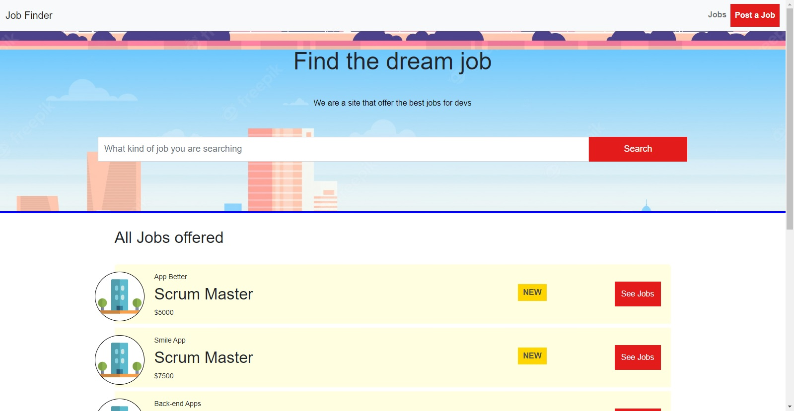
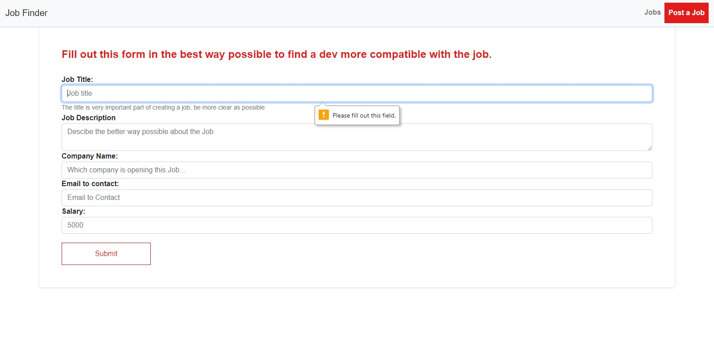
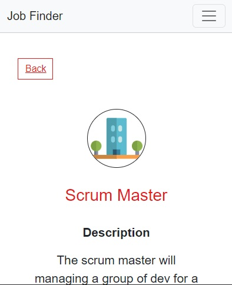

# Job Finder

## Informações Básica
  
Este projeto ele é sobre um site onde companhias poderiam criar vagas de trabalho e desenvolvedores poderiam acessar para buscar por estas vagas.
 
  
Esse projeto ele foi desenvolvido seguindo o passo-a-passo de um curso de <a href="https://www.udemy.com/course/javascript-do-basico-ao-avancado-com-node-e-projetos/">JavaScript</a>, na plataforma Udemy.

  ## Páginas

  

    

      A pagina inicial contem a barra de navegação, barra de pesquisa e uma lista dos trabalhos que estão sendo orfertados.
    

    
    <h2>Página Inicial em Telas Menores</h2>
    
O site também suporta em telas menores, como os de telefone

    
    <h2>Página de Formulário</h2>
    
    
No Formulário é necessário que dados sejam passados em todos os campos, não é permitido submeter os dados para serem postados com algum campo faltando, o site irá apontar qual campo esta faltando ser preenchido.
    A maioria dados tem tipo de entrada no banco de dados como texto.
    

    <h2>Página De Detalhes Da Vaga</h2>
    
    
  
